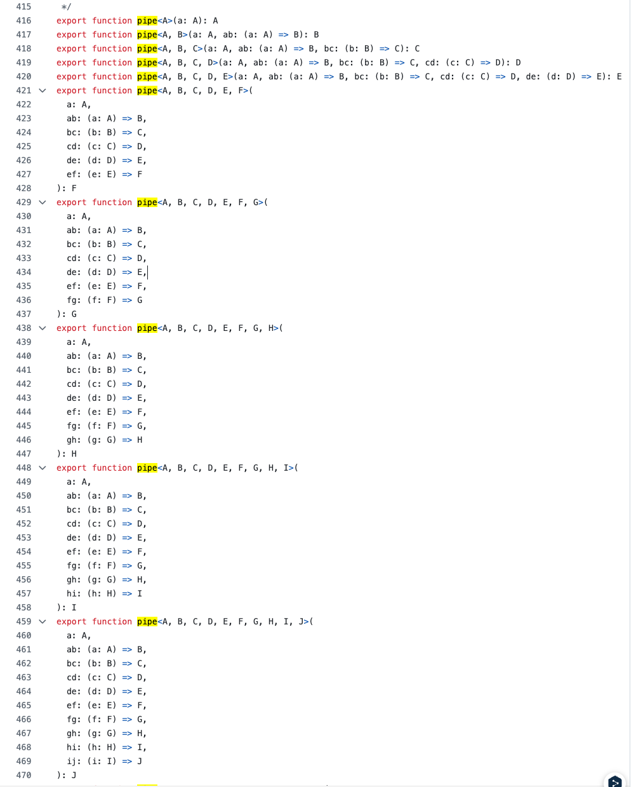

## pipe 함수 구현 학습 기록

```ts
구현 조건
- pipe(...fns)는 여러 함수를 왼쪽 → 오른쪽으로 순차적으로 실행하는 함수입니다.
- pipe(f, g, h)(x)는 h(g(f(x)))와 동일한 결과를 반환해야 합니다.
- 첫 번째 함수는 단일 인자를 받고, 이후 함수들도 이전 함수의 결과를 받아야 합니다.
- 제네릭 타입을 사용해 타입 추론이 가능하도록 구현해 보세요.
- App.tsx에서 테스트 코드를 실행해 확인하세요.

// 실행 예시

const add1 = (n: number) => n + 1;
const double = (n: number) => n * 2;
const square = (n: number) => n * n;

const pipeline = pipe(add1, double, square);
console.log(pipeline(2)); // ((2 + 1) * 2)² = 36
```

### 구현 과정과 배운 점

> **1차 구현 - reduce 초기값 설정의 함정**

```ts
export const pipe = (...fns: any[]) => {
  return (n: T) => {
    const first = fns[0];
    return fns.slice(1).reduce((acc, fn) => {
      return fn(acc);
    }, first(n));
  };
};
```

**구현 후기, 어려웠던 점**

- 매번 타이핑을 고민하는데 시간을 지체하는 것 같아서 이번엔.. 그러면 안되지만 any 배열로 받고 내부 로직 구현에 더 시간을 쏟았다.

- 함수를 왼쪽에서 오른쪽으로 순차적으로 실행한다는 점에서 reduce 함수를 떠올린 것 까진 좋았는데 reduce의 초기값을 설정하는데서 조금 헤맸다.
- reduce의 초기값을 어떻게 설정할지 고민하다가 불필요하게 복잡한 로직으로 작성된 부분이 아쉽다.
- 첫 번째 함수를 호출한 것을 reduce 초기 값으로 사용하고 나머지 함수를 실행시키는 방법을 생각했었다.
- AI에게 리뷰를 받으니 호출 시점에 받은 `n`을 그대로 초기값으로 쓰면 된다는 말에 사고가 갇혀있었어서 불필요하게 slice 메서드를 사용했다는 것을 깨달았다.

**이 코드의 문제점**

- `fns` 배열이 비어있는 경우 처리가 안된다.

- 불필요한 `slice(1)` 로직

## AI에게 리뷰 후 수정 버전

```ts
export const pipe = <T>(...fns: Array<(arg: T) => T>) => {
  return (initialValue: T): T => {
    return fns.reduce((acc, fn) => fn(acc), initialValue);
  };
};
```

간단히 AI가 타이핑을 작성해주긴 했지만 타이핑이 완전히 잘 된 코드는 아니라서

라이브러리에서 pipe함수를 어떻게 타이핑하고 있는지 궁금해서 찾아봤다.



그만 알아보도록하자..

수동으로 오버로드를 잔득 작성하는 방법밖에 없나보다.ㅠ
